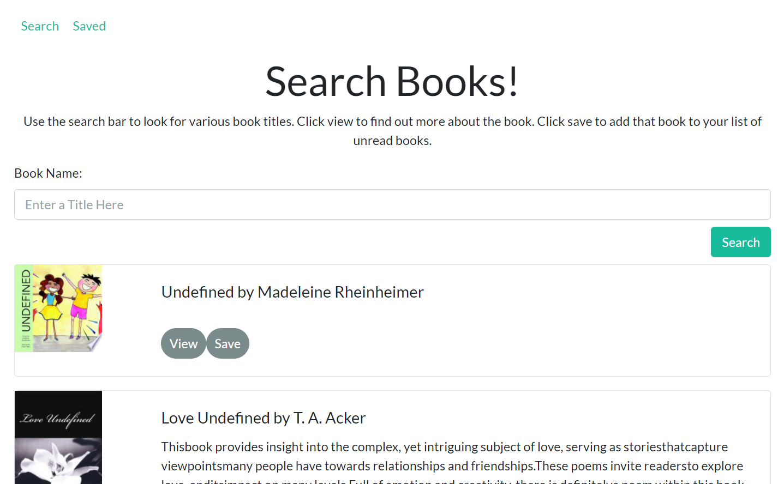
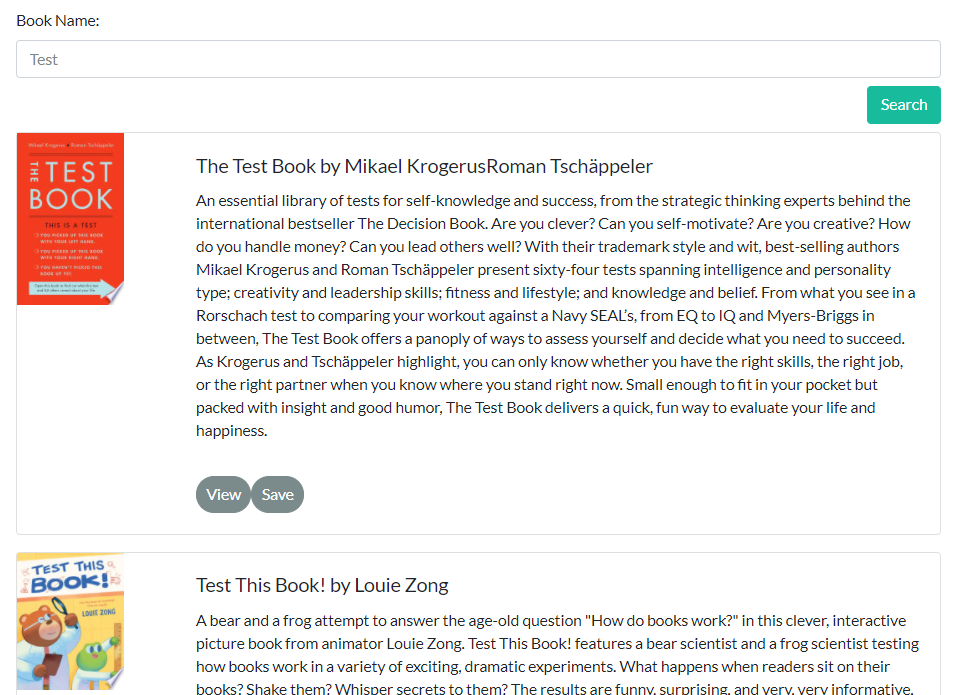

# Google Books Search

## Description

In this project I have created a React-based Google Books Search app. I created React components, worked with helper/util functions, and utilized React lifecycle methods to query and display books based on user searches. Node, Express and MongoDB were used so that users can save books to review or purchase later.

## Application Depoloyment

Click this link to take you to the deployed app: https://radiant-reaches-21235.herokuapp.com/

## Table of Contents

- [License](#license)
- [Contributions](#contributions)
- [Screenshot](#screenshot)
- [Questions](#questions)

## License

[MIT License Link](https://spdx.org/licenses/MIT.html)

## Contributions

Sole Author: Kristen Picard
https://github.com/kristenpicard

## Screenshots

Here is the home page:

This shows books displayed when searching the word, "test":

## Questions

If you would like to discuss this project, please reach out via my GitHub:

GitHub: [Kristen Picard GitHub](https://github.com/kristenpicard)
